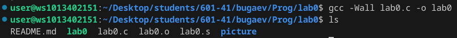
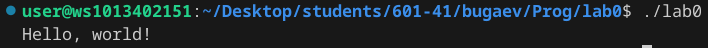
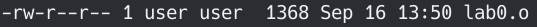
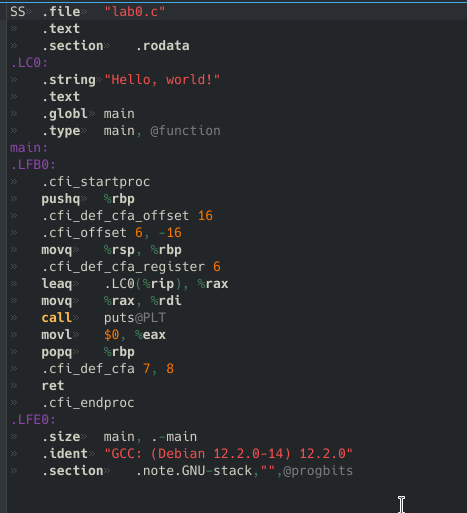
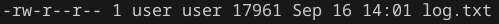

# Лаба номер 0
## Задание 
Написать свою первую программу на C. Загрузить её на репозиторий в GitHub.
## Проделанная работа

```c
#include <stdio.h>

int main()
{
    printf("Hello, world!\n");
    return 0;
}
```
1. полная сборка програмы (gcc -Wall lab0.c -o lab0)



2. результат работы программы (./lab0)



3. получаем обьектный файил (gcc -Wall -c lab0.c)



4. асемблерный код (gcc -Wall -S lab0.c)



5. получем файл log.txt собержаший препроцессинговый код (gcc -E lab0.c)



