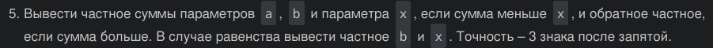

# Лаба номер 1
## Задание
Разобрать код; составить блок схему для своей програмы; написать программу, решающую задачу по своему варианту.
## Проделанная работа

1. задание (Вариант 5)



2. написал код для решение своего варианта

```c
#include <stdio.h>

int main()
{
    float a, b, x;
    printf("Enter a -> ");
    scanf("%f", &a);
    printf("Enter b -> ");
    scanf("%f", &b);
    printf("Enter x -> ");
    scanf("%f", &x);

    if (!a && !b && !x)
        return 0;       
    float sum = a + b;

    float usl1 = sum / x;
    if ( sum < x)
        printf("ответ = %.3f \n", usl1);
    
    float usl2 = x / sum;
    if (sum > x)
        printf("ответ = %.3f \n", usl2);
    
    float usl3 = b / x;
    if (sum == x)
        printf("ответ = %.3f \n", usl3);
}
```

3. создал блок схему кода


