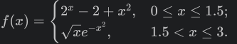
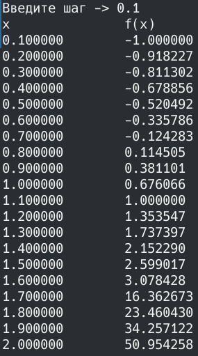
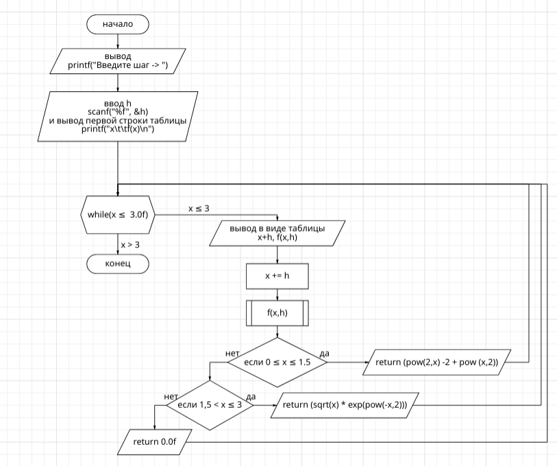
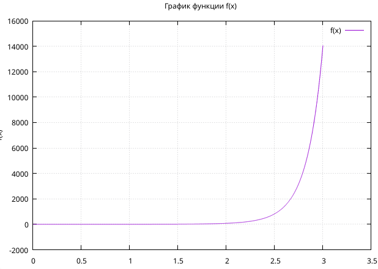

# Лаба номер 2
## Задание
- Написать программу по варианту, используя оператор цикла while/for.
- Построить график с использованием gnuplot.
- Составить блок-схемы.
- Оформить отчёт в README.md. Отчёт должен содержать:
1. Задание
2. Описание проделанной работы
3. Скриншоты результатов
4. Блок-схемы
5. График функции
6. Ссылки на используемые материалы

## Проделанная работа
задание (5 Вариант)



1. код программы для While

```c
#include <stdio.h>
#include <math.h>

float f(float x, float h){
    const float eps = h/2;
    if (x > 0.0f - eps && x <= 1.5f + eps)
        return (pow(2,x) -2 + pow (x,2));
    else if (x > 1.5f + eps &&  x <= 3.0f + eps)
        return (sqrt(x) * exp(pow(-x,2)));
    return 0.0f;
}

int main()
{
    float h, x = 0;
    printf("Введите шаг -> "); scanf("%f", &h);
    printf("x\t\tf(x)\n");
    while(x <= 3.0f) {
        printf("%f\t%f\n", x+h, f(x,h));
        x += h;
    }
    return 0;

}
```

2. код программы для for

```c
#include <stdio.h>
#include <math.h>

float f(float x, float h){
    const float eps = h/2;
    if (x > 0.0f - eps && x <= 1.5f + eps)
        return (pow(2,x) -2 + pow (x,2));
    else if (x > 1.5f - eps &&  x <= 3.0f + eps)
        return (sqrt(x) * exp(pow(-x,2)));
    return 0.0f;
}

int main()
{
    float h;
    printf ("Введите h "); scanf("%f", &h);
    printf("x\t\tf(x)\n");
    for(float x = 0; x <= 3.0f; x += h)
        printf("%f\t%f\n", x+h, f(x,h));
    return 0;
}
```

3. Вывод программы:



4. Блок схемы для программ (Схемы с while\for не отличаются, суть одна)



5. График функции с помощью gnuplot(файлы plot.gpi и my_graph.txt)



6. https://habr.com/ru/companies/ruvds/articles/517450/


