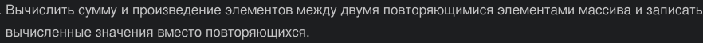
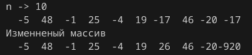

# Лаба номер 3
## Задание
1. Написать программу по варианту.
2. Оформить отчёт в README.md. Отчёт должен содержать:
- Задание
- Описание проделанной работы
- Скриншоты результатов
- Ссылки на используемые материалы

# задание (5 Вариант)



## Требования и ограничения. 
 Количество элементов массива вводить с клавиатуры, массив заполнить случайными числами. Необходимые расчёты и модификации реализовать в виде функций.

## Проделанная работа
1. Написан код на c для выполненния задания
```c
#include <stdio.h>
#include <stdlib.h>
#include <time.h>

void fill(int n, int a[])
{
    int i;
    for (i = 0; i < n; i++)
        a[i] = rand () % 101 - 50;
}

void lol(int n, int a[]){
    for (int i = 0; i<n; i++){
        for (int j = i+1; j<n; j++)
            if (a[i] == a[j]){
                int sum = 0;
                int proiz = 1;
                for (int k = i+1; k <j;k++){
                    sum += a[k];
                    proiz = proiz * a[k];
                }
                a[i] = sum;
                a[j] = proiz;
                break;
            }
    }
    
}


int main()
{
    srand(time(NULL));
    int n;
    printf("n -> ");
    scanf("%d", &n);
    int A[n];
    fill(n, A);
    int i;
    for (i = 0; i < n; i++)
        printf("%4d", A[i]);
    printf("\n");
    printf("Изменненый массив\n");
    lol(n,A);
    for (i = 0; i < n; i++)
        printf("%4d", A[i]);
    printf("\n");
    return 0;
}
```

2. Скомпилирован и запущен
3. Вывод программы



Примечания:
1. программа ни как не меняет массив, если в нем нету повторяющихся цифр
2. первая повторяющаяся цифра заменяется суммой, вторая произведением
 
# Ссылки на изпользуемые ресурсы
- https://evil-teacher.on.fleek.co/prog_pm/term1/lab03/
- https://prog-cpp.ru/c-massiv/
- https://prog-cpp.ru/c-cycles/