# Лаба номер 4
## Задание №0
- Задача: Составть словарь словарей расстояния между городами

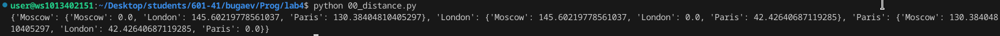

## Задание №1
- Задача: Вывести в консоль площадь круга, перенадлежили ли точка 1,2 к кругу
- Результат

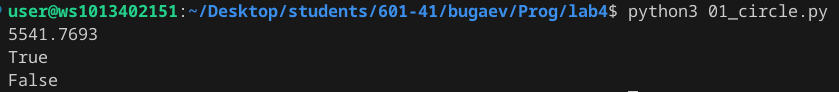

## Задание №2
- Задача: Поставить знаки (+),(-),() между цифрами 1 2 3 4 5 что бы получилось число 25
- Результат
```python
res = 1*2+3+4*5
print(res)
```
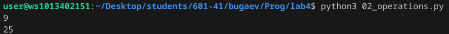

Примечание: цифра 9 в скриншоте, как пример задания

## Задание №3
- Задача: Данна строка my_favorite_movies = 'Терминатор, Пятый элемент, Аватар, Чужие, Назад в будущее', из строки вывести первый, последний, втрой, второй с конца фильмы
1. код
```python
print(my_favorite_movies[:10])
print(my_favorite_movies[42:])
print(my_favorite_movies[12:25])
print(my_favorite_movies[35:40])
```
2. результат

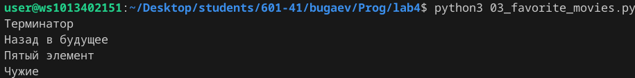

## Задание №4
- Дан список списков роста семьи
- Задачи:
1. Выписать рост отца
2. Выписать общий рост семьи

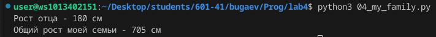


## Задание №5
- Дан список zoo = ['lion', 'kangaroo', 'elephant', 'monkey', ]
- Задача: Вополнить задания по списку
1. Посадите медведя (bear) между львом и кенгуру
2. Добавьте птиц из списка birds в последние клетки зоопарка
3. Уберите слона
4. Выведите на консоль в какой клетке сидит лев (lion) и жаворонок (lark)
- Результат

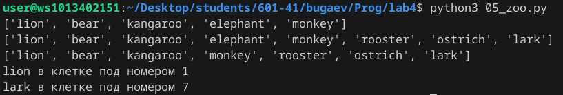

## Задание №6
- Дан список и словарь
- Задача: Выписать обшие врямя звучания 3-х песен
- результат

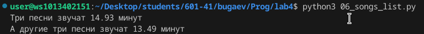

## Задание №7
- Дано зашифрованное сообшение
- Задача: рассшифровать по плану
1. Code
```python
sm = secret_message
print(sm[0][3],sm[1][9:13],sm[2][5:15:2],sm[3][12:6:-1],sm[4][20:15:-1])
```
2. Резульат

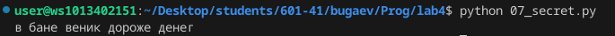

## Задание №8
- Даны списки garden и  meadow
- Задача: Сделать из них множества и выполнить нелько выводов
1. выведите на консоль все виды цветов
2. выведите на консоль те, которые растут и там и там
3. выведите на консоль те, которые растут в саду, но не растут на лугу
4. выведите на консоль те, которые растут на лугу, но не растут в саду
```python
garden_set = set(garden)
meadow_set = set(meadow)

print(garden_set.union(meadow_set))
print(garden_set.intersection(meadow_set))
print(garden_set.difference(meadow_set))
print(meadow_set.difference(garden_set))

```

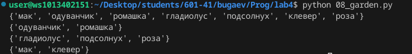

## Задание №9
- Задача: Создайте словарь цен на продкты следующего вида и выписать 2 магазина с минимальными ценами
```python
for i in sweets.keys():
    print(i,end=' - ')
    i = sweets[i]
    if i[0]['price'] < i[1]['price']:
        print( i[0]['shop'],end=' ')
        if i[1]['price'] < i[2]['price']:
             print( i[1]['shop'],end=' ')
        else:
            print( i[2]['shop'],end=' ')
    elif i[1]['price'] < i[0]['price']:
        print( i[1]['shop'],end=' ')
        if i[0]['price'] < i[2]['price']:
            print( i[0]['shop'],end=' ')
        else:
            print( i[2]['shop'],end=' ')
    print(' ')
```

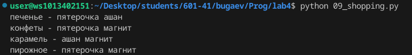

## Задание №10
- Задача: Вывести стоимость каждого вида товара на складе: Формат строки <товар> - <кол-во> шт, стоимость <общая стоимость> руб
1. code
```python
table_cost = store[goods['Стол']][0]['quantity'] * store[goods['Стол']][0]['price'] + store[goods['Стол']][1]['quantity'] * store[goods['Стол']][1]['price']
table_count = store[goods['Стол']][0]['quantity'] + store[goods['Стол']][1]['quantity']

sofa_cost = store[goods['Диван']][0]['quantity'] * store[goods['Диван']][0]['price'] + store[goods['Диван']][1]['quantity'] * store[goods['Диван']][1]['price']
sofa_count = store[goods['Диван']][0]['quantity'] + store[goods['Диван']][1]['quantity']

chair_cost = store[goods['Стул']][0]['quantity'] * store[goods['Стул']][0]['price'] + store[goods['Стул']][1]['quantity'] * store[goods['Стул']][1]['price'] + store[goods['Стул']][2]['quantity'] * store[goods['Стул']][2]['price']
chair_count = store[goods['Стул']][0]['quantity'] + store[goods['Стул']][1]['quantity'] + store[goods['Стул']][2]['quantity']

print('Стол -', table_count, 'шт, стоимость', table_cost, 'руб')
print('Диван -', sofa_count, 'шт, стоимость', sofa_cost, 'руб')
print('Стул -', chair_count, 'шт, стоимость', chair_cost, 'руб')
```

2. Вывод

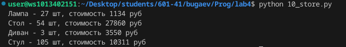
