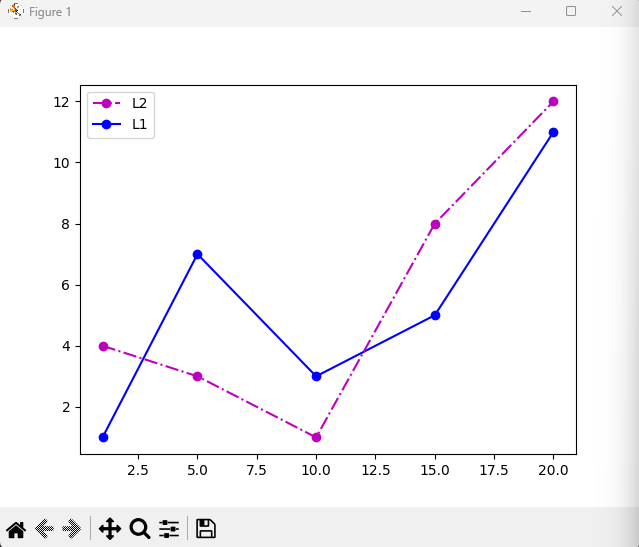

# Лаба номер 5
## Уроки из книги
### 1


### 2


### 3




## График функции из своего варианта (вариант 5)
$$
f(x) = 2^x - 2 + x^2
$$
```python
import numpy as np
import matplotlib.pyplot as plt


def f(x):
    return 2**x - 2 + x**2

def f_prime(x):
    return 2**x * np.log(2) + 2*x

x_tangent = 1
y_tangent = f(x_tangent)
slope = f_prime(x_tangent)


def tangent_line(x):
    return slope * (x - x_tangent) + y_tangent

x = np.linspace(-2, 3, 400)
y = f(x)
y_tangent = tangent_line(x)

plt.plot(x, y, label=r'$f(x) = 2^x - 2 + x^2$', color='blue')
plt.plot(x, y_tangent, label='Касательная', color='red', linestyle='--')

plt.title('График функции и касательной')
plt.xlabel('x')
plt.ylabel('y')
plt.legend()
plt.grid(True)

plt.show()
```


