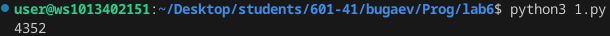
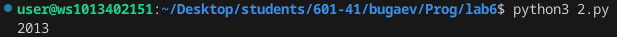
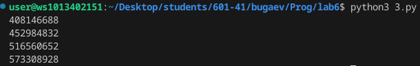

# Лаба номер 6
### Вариант 5

## 1
 
 - Вася составляет 6-буквенные слова, в которых могут быть использованы только буквы В, И, Ш, Н, Я, причём буква В используется не более одного раза. Каждая из других допустимых букв может встречаться в слове любое количество раз или не встречаться совсем. Слово не должно начинаться с буквы Ш и оканчиваться гласными буквами. Словом считается любая допустимая последовательность букв, не обязательно осмысленная. Сколько существует таких слов, которые может написать Вася?

```python
from itertools import product
С = 0
for i in product('ВИШНЯ',repeat=6):
    if i.count('В') < 2 and i[0] != 'Ш' and i[5] != 'И' and i[5] != 'Я':
        С = С +1
print(С)
```



## 2
 
 - Сколько единиц содержится в двоичной записи значения выражения $4^{2014}+2^{2015}-8$?
```python
i = 4**2014 + 2**2015 - 8
print(bin(i).count('1'))
```



## 3
- Найдите все натуральные числа N, принадлежащие отрезку $[400 000 000; 600 000 000]$, которые можно представить в виде N  =  $2^{m} ⋅ 3^{n}$, где m — чётное число, n — нечётное число. Выведите все найденные числа в порядке возрастания.

```python
c = []
for m in range(2, 1000, 2):
    for n in range(1, 1000, 2):
        x = 2**m * 3**n
        if x >= 400000000 and x <= 600000000:
            c.append(x)
        if x > 600000000:
            break
c.sort(reverse=False)
for i in c:
    print(i)
```

