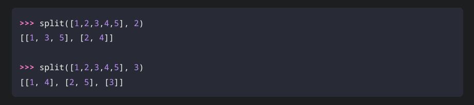
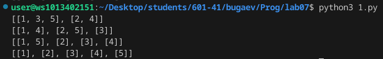
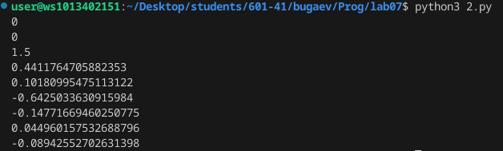

# Лаба номер 7
## Вариант 5
### Задача 1: Написать функцию, которая разделяет список на n частей.
### примеры вывода



```python
def split(a,b):
    res = [[] for i in range(b)]
    for i in range(len(a)):
        res[i%b].append(a[i])
    return(res)

print(split([1,2,3,4,5],2))
print(split([1,2,3,4,5],3))
print(split([1,2,3,4,5],4))
print(split([1,2,3,4,5],5))
```



### Задача 2:


```python
def v(i):
    if i == 1 or i == 2: return 0
    if i == 3: return 1.5
    return ((i+1)/(i**2 +1)) * v(i-1) - v(i-2) * v(i-3)

for i in range(1,10):
    print(v(i))
```

