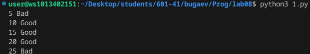
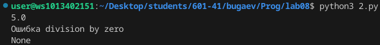

# Лаба номер 8
### Вариант 5
## 1 
- Замыкание, определяющее нахождение аргуметов в допустимых диапазонах.
 ```python
def f1(min,max):

    def f2(val):
        if min <= val <= max:
            return 'Good'
        else:
            return 'Bad'

    return f2


x = f1(10,20)
for i in range(5,30,5):
    print(i, x(i))
 ```



## 2
- Декоратор, который будет оборачивать каждую функцию в try блок для обработки ошибок.
```python
def f1(f):

    def f2(a,b):
        try:
            return f(a,b)
        except Exception as e:
            print('Ошибка',e)
    return f2

@f1
def del1(x,y):
    return x/y


print(del1(10,2))
print(del1(10,0))
```


