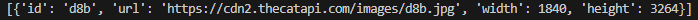

# Лабораторная работа №9
## Вариант 5
Задача: Генератор, который обращается к внешнему API и возвращает результаты запросов.

## Решение
```python
import requests

def api_request(url):
    while True:
        response = requests.get(url)
        
        if response.status_code == 200:
            yield response.json()
        else:
            print(f"Ошибка запроса: {response.status_code}")
            break

url = "https://api.thecatapi.com/v1/images/search"

cat_gen = api_request(url)

for cat_data in cat_gen:
    print(cat_data)
    break
```
## Вывод программы

