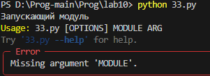

# Лаба номер 10
## Задание:
- Создайте пакет, содержащий 3 модуля на основе лабораторных работ №№ 7-9
- Напишите запускающий модуль на основе Typer, который позволит выбирать и настраивать параметры запуска логики из пакета.
- Оформите отчёт в README.md. Отчёт должен содержать:
- Условия задач
- Описание проделанной работы
- Скриншоты результатов
- Ссылки на используемые материалы

## Решение:
1. Созданна директория lab10_package
2. Создан в директории lab10_package файл __ init__.py
3. Добавлены лабы 7-9 в директорию lab10_package
4. Написан код в 33.py

```python
from lab10_package import lab7,lab8,lab9
import typer

def main(module: str, arg):
    match module:
        case '7': print(lab7.split(arg))
        case '8': print(lab8.f3(arg))
        case '9': print(lab9.f1(arg))
        case _: print(f"Неизвестный модуль: {module}")


if __name__ == "__main__":
    print("Запускающий модуль")
    typer.run(main)
```
### Результаты работы
- Вывод без аргумента



- лаба номер 7


- лаба номер 8


- лаба номер 9


- если модуль неверный


