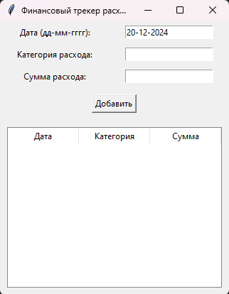
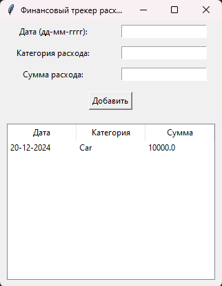

## Лаба 11
# Вариант 5
# Задача:

Создать финансовый трекер расходов.

# Решение

```python
import tkinter as tk
from tkinter import messagebox
from tkinter import ttk
import csv
from datetime import datetime

def save_expenses(expenses):
    with open('expenses.csv', mode='a', newline='') as file:
        writer = csv.writer(file)
        writer.writerow([expenses['date'], expenses['category'], expenses['amount']])

def load_expenses():
    expenses_list = []
    try:
        with open('expenses.csv', mode='r') as file:
            reader = csv.reader(file)
            for row in reader:
                expenses_list.append(row)
    except FileNotFoundError:
        pass
    return expenses_list

def update_expenses_table():
    for row in expense_tree.get_children():
        expense_tree.delete(row)
    
    expenses = load_expenses()
    for expense in expenses:
        expense_tree.insert("", "end", values=(expense[0], expense[1], expense[2]))

def add_expense():
    date = entry_date.get()
    category = entry_category.get()
    amount = entry_amount.get()

    if not date or not category or not amount:
        messagebox.showerror("Ошибка", "Пожалуйста, заполните все поля!")
        return
    
    try:
        amount = float(amount)
        expenses = {'date': date, 'category': category, 'amount': amount}
        save_expenses(expenses)
        update_expenses_table()
        entry_date.delete(0, tk.END)
        entry_category.delete(0, tk.END)
        entry_amount.delete(0, tk.END)
    except ValueError:
        messagebox.showerror("Ошибка", "Введите корректную сумму!")

root = tk.Tk()
root.title("Финансовый трекер расходов")

label_date = tk.Label(root, text="Дата (дд-мм-гггг):")
label_date.grid(row=0, column=0, padx=10, pady=5)

entry_date = tk.Entry(root)
entry_date.grid(row=0, column=1, padx=10, pady=5)
entry_date.insert(0, datetime.today().strftime('%d-%m-%Y'))

label_category = tk.Label(root, text="Категория расхода:")
label_category.grid(row=1, column=0, padx=10, pady=5)

entry_category = tk.Entry(root)
entry_category.grid(row=1, column=1, padx=10, pady=5)

label_amount = tk.Label(root, text="Сумма расхода:")
label_amount.grid(row=2, column=0, padx=10, pady=5)

entry_amount = tk.Entry(root)
entry_amount.grid(row=2, column=1, padx=10, pady=5)

btn_add = tk.Button(root, text="Добавить", command=add_expense)
btn_add.grid(row=3, column=0, columnspan=2, pady=10)

columns = ('Дата', 'Категория', 'Сумма')
expense_tree = tk.ttk.Treeview(root, columns=columns, show='headings')
expense_tree.grid(row=4, column=0, columnspan=2, padx=10, pady=10)

for col in columns:
    expense_tree.heading(col, text=col)
    expense_tree.column(col, width=100)

update_expenses_table()

root.mainloop()
```



.