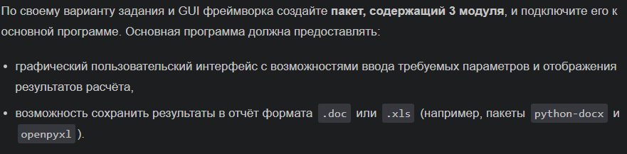
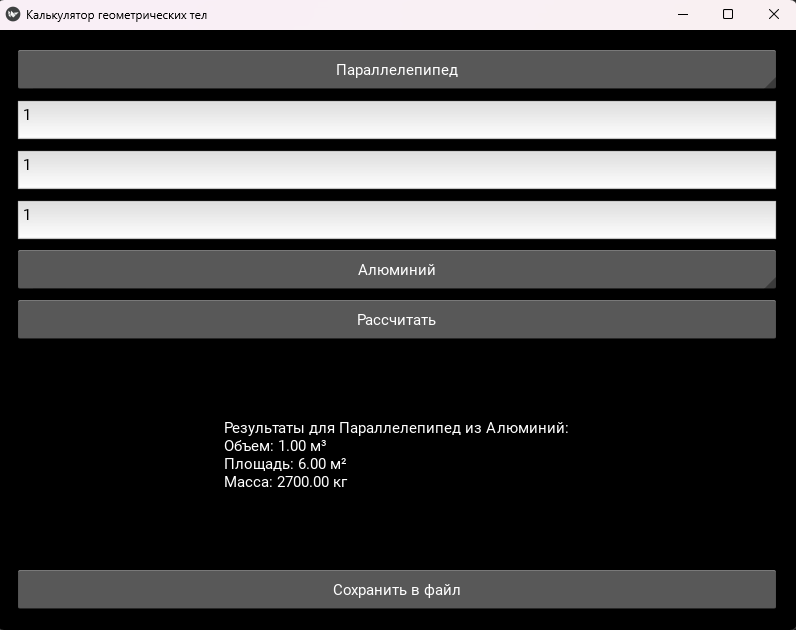

# Лаба 12
## Вариант 3
## Задача (основная):



## Мой вариант 3.Kivy


## Скрин



## Содержимое сохраненного файл

```
Отчет создан: 2025-03-31 00:26:03

Результаты для Параллелепипед из Алюминий:
Объем: 1.00 м³
Площадь: 6.00 м²
Масса: 2700.00 кг
```

