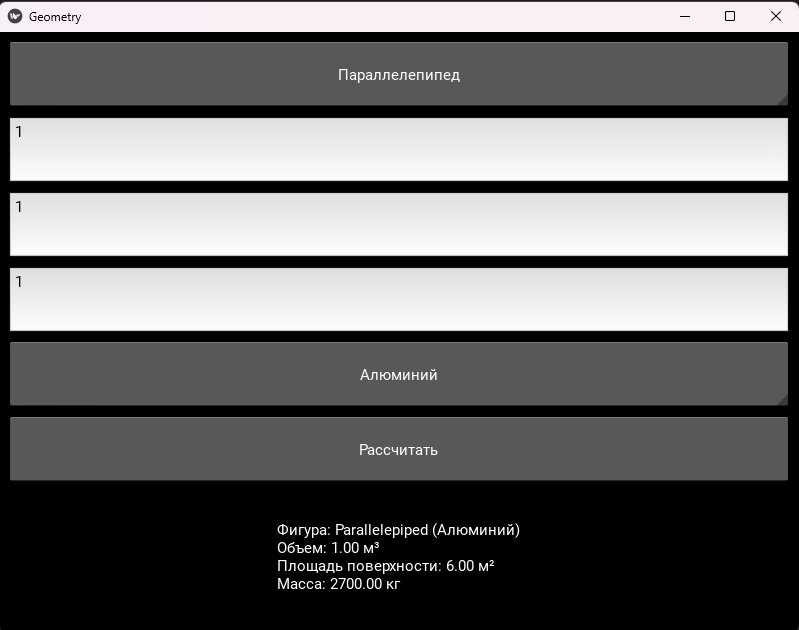

# Лабораторная работа №13
Перепишите свой вариант лабораторной работы №12 с использованием классов и объектов.
Задание то же, вариант GUI фреймворка возьмите следующий по списку.
В коде должны присутствовать:
- абстрактный базовый класс и соотвествующие декораторы для методов
- иерархия наследования
- managed - атрибуты
- минимум 2 dunder-метода у подклассов
## Вариант 3
Геометрические тела

- Параллелепипед
- Тетраэдр
- Шар

Расчёт объема, площади поверхности, массы в зависимости от материала.

