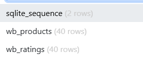
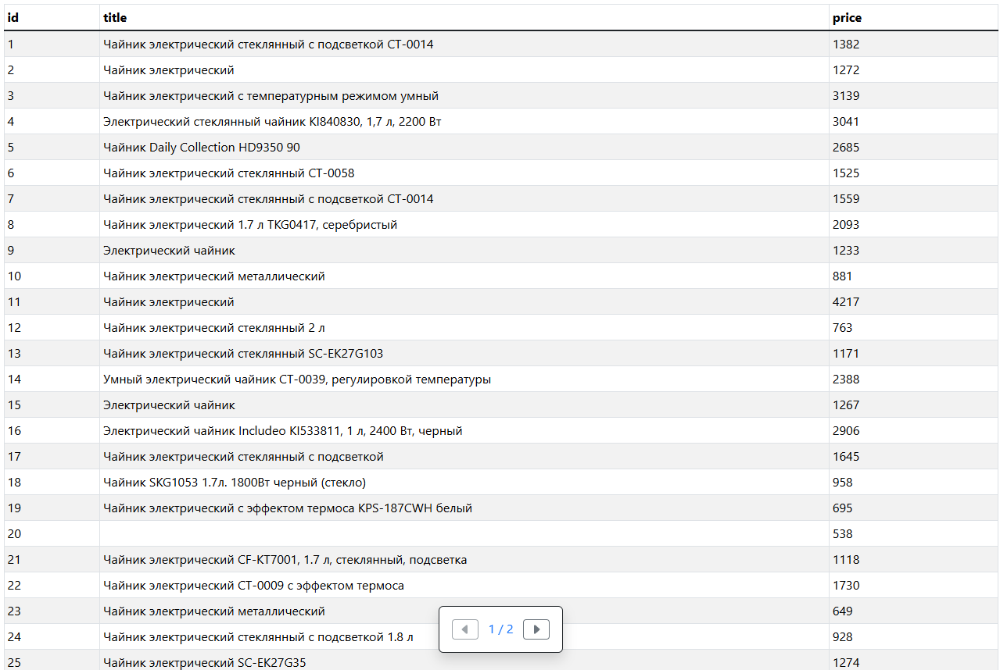
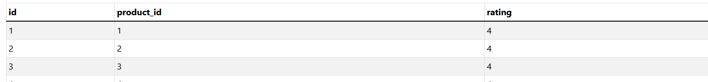
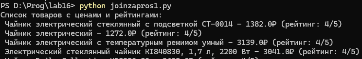
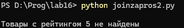
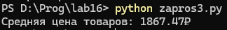
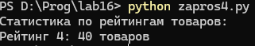
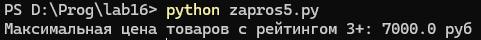

# Лабораторная работа №16 | WB
## Задание 
1) Реализуйте парсер с использованием Selenium для сбора данных с веб-страницы. Это может быть:
    - онлайн-каталог
    - интернет-магазин
    - энциклопедия и т.д.

2) Создайте таблицы БД и заполните их данными, полученными с помощью парсера. У вас должно быть **минимум 2** таблицы. При заполнении в запросах используйте именованные плейсхолдеры драйвера вашей СУБД.
3) Напишите запросы для выборки данных из БД с использованием ***PyPika Query Builder***. У вас должно быть:
    - 2 запроса с JOIN
    - 3 запроса с расчётом статистики/группировкой/агрегирующими функциями
4) Оформите отчёт в README.md. Отчёт должен содержать:
    - Условия задач
    - Описание проделанной работы
    - Скриншоты результатов
    - Ссылки на используемые материалы
## Проделанная работа
### База данных заполненая парсером:
1) 
2) 
3) 
### Запросы:
1) Выбрать все чайников с их рейтингами:
``` python 
q = Query.from_(products) \
        .join(ratings) \
        .on(products.id == ratings.product_id) \
        .select(products.title, products.price, ratings.rating)
```
Результат:



2) Выбрать чайников с рейтингом 5
``` python
q = Query.from_(products) \
    .join(ratings) \
    .on(products.id == ratings.product_id) \
    .select(products.title, products.price, ratings.rating) \
    .where(ratings.rating == 5)
```
Результат:



3) Средняя цена чайников
``` python
q = Query.from_(products).select(fn.Avg(products.price).as_("avg_price"))
```
Результат:



4) Кол-во чайников по каждому рейтингу (группировка):
``` python
q = Query.from_(reviews) \
    .select(reviews.rating, fn.Count(reviews.id).as_("count")) \
    .groupby(reviews.rating)
```
Результат:



5) Максимальная цена чайника с рейтингом >= 3:
``` python
q = Query.from_(products) \
    .join(reviews) \
    .on(products.id == reviews.product_id) \
    .select(fn.Max(products.price).as_("max_price")) \
    .where(reviews.rating >= 3)
```
Результат:

