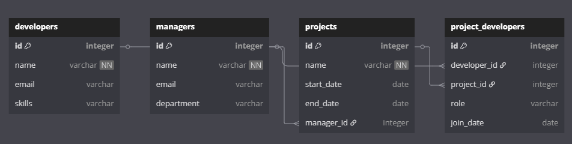

# Лабораторная работа №17 | Вариант 3
## Задание 
1) Спроектируйте БД с использованием ```crow’s foot notation```.
2) Напишите модели данных, создайте и заполните БД с помощью ```SQLAlchemy```.
3) Напишите запросы для выборки и анализа данных из БД.
4) Оформите отчёт в README.md. Отчёт должен содержать:
    - Условия задач
    - Описание проделанной работы
    - Скриншоты результатов
    - Ссылки на используемые материалы
### Задание варината
Разработка ПО. У каждого проекта есть своя команда разработчиков, но единственный менеджер. Разработчики могут участвовать в нескольких проектах одновременно.
## Проделанная работа:
### Crow’s foot notation

### База данных
1) 
2) 
3) 
4) 
### Запросы
1) Все разработчики и проекты, в которых они участвуют
``` python
q1 = (Query.from_(developers)
     .join(project_developers).on(developers.id == project_developers.developer_id)
     .join(projects).on(project_developers.project_id == projects.id)
     .select(developers.name.as_("developer"), projects.name.as_("project"), project_developers.role)
     .orderby(developers.name))
```
Результат:


2) Получить все проекты с их менеджерами
``` python
q2 = (Query.from_(projects)
     .join(managers).on(projects.manager_id == managers.id)
     .select(projects.name.as_("project"), managers.name.as_("manager"), 
             projects.start_date, projects.end_date))
```
Результат:


3) Количество разработчиков на каждом проекте
``` python
q3 = (Query.from_(projects)
     .join(project_developers).on(projects.id == project_developers.project_id)
     .groupby(projects.name)
     .select(projects.name, fn.Count(project_developers.developer_id).as_("developers_count")))
```
Результат:


4) Найти разработчиков с определенным навыком (Python)
``` python
q4 = (Query.from_(developers)
     .where(developers.skills.like(f"%{skill_to_find}%"))
     .select(developers.name, developers.skills))
```
Результат:


