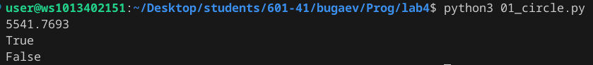
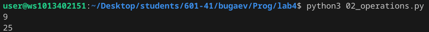
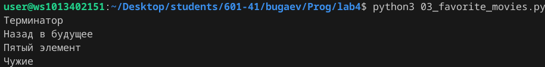
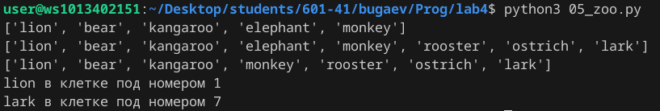

# Лаба номер 4
## Задание №0
- Задача:

## Задание №0
- Задача:

## Задание №1
- Задача: Вывести в консоль площадь круга, перенадлежили ли точка 1,2 к кругу
- Результат



## Задание №2
- Задача: Поставить знаки (+),(-),() между цифрами 1 2 3 4 5 что бы получилось число 25
- Результат
```python
res = 1*2+3+4*5
print(res)
```


Примечание: цифра 9 в скриншоте, как пример задания

## Задание №3
- Задача: Данна строка my_favorite_movies = 'Терминатор, Пятый элемент, Аватар, Чужие, Назад в будущее', из строки вывести первый, последний, втрой, второй с конца фильмы
- Результат
```python
print(my_favorite_movies[:10])
print(my_favorite_movies[42:])
print(my_favorite_movies[12:25])
print(my_favorite_movies[35:40])
```


## Задание №4
- Задача:

## Задание №5
- Задача: Дан список zoo = ['lion', 'kangaroo', 'elephant', 'monkey', ] вополнить задания по списку
1. Посадите медведя (bear) между львом и кенгуру
2. Добавьте птиц из списка birds в последние клетки зоопарка
3. Уберите слона
4. Выведите на консоль в какой клетке сидит лев (lion) и жаворонок (lark)
- Результат



## Задание №6
- Задача:

## Задание №7
- Задача:

## Задание №8
- Задача:

## Задание №9
- Задача:

## Задание №10
- Задача: